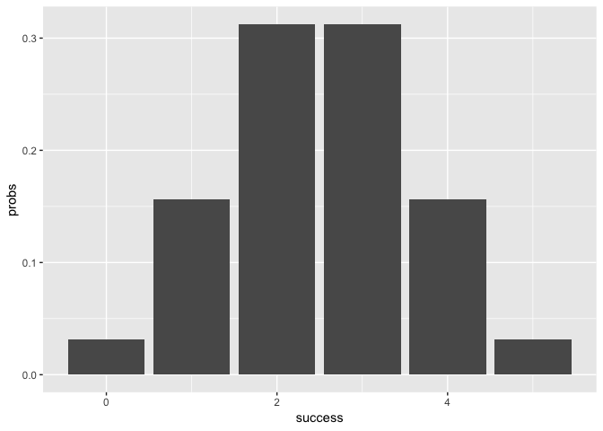

<!-- README.md is generated from README.Rmd. Please edit that file -->
``` r
library(ggplot2)
```

Overview
--------

`"binomial"` is a niminal [R](http://www.r-project.org/) pacjage that provides functions to obtain statistics for binomial distributions.

-   `bin_choose()` calculates the number of combinations possible for `k` successes in `n` trials.
-   `bin_probability()` calculates the probability of getting `k` successes in `n` trials.
-   `bin_distribution()` returns a data frame of class `bindis`. The number of successes is in the first column, and the probability of the corresponding number of successes is in the second.
-   `plot()` is a method for bin\_distribution that takes an input of class `bindis`, creating a barplot for the successes and their probabilities.
-   `bin_cumulative()` returns a data frame of the class `bincum`. The number of succeses is in the first column, the probability of the corresponding success is in the second, and the cumulative probabilities are in the third.
-   `plot()` is a method also used for an input of class `bincum`. This creates a line graph.
-   `bin_variable()` creates a named list of class `binvar` for trials and probabilities.
-   `print()` method is used for `binvar` objects to print out the number of trials and probability.
-   `summary()` method is used for `binvar` objects to compute summary statistics.
-   `print.summary()` method is used for `summary.binvar` objects to print out the trials, probability, and the summary statistics.

Motivation
----------

The reason behind creating this package was to explore and learn how to create an R package using devtools. We have written RScripts for private and main functions and tests.

Installation
------------

To install the package from Github, use the package "devtools"

``` r
# development version from Github:
#install.packages("devtools")

# install "binomial" (without vignettes)
#devtools::install_github("stat133-sp19/hw-stat133-jesskimy/tree/master/binomial")

# install "binomial" (with vignettes)
#devtools::install_github("stat133-sp19/hw-stat133-jesskimy/tree/master/binomial", build_vignettes = TRUE)
```

Usage
-----

``` r
library(binomial)

#Combinations of 3 heads in 5 coin tosses
bin_choose(n = 5, k = 3)
#> [1] 10

#Probability of getting 3 heads in 5 coin tosses
bin_probability(3, 5, 0.5)
#> [1] 0.3125

#Distribution of probabilities for 5 coin tosses
bin_distribution(5, 0.5)
#>   success   probs
#> 1       0 0.03125
#> 2       1 0.15625
#> 3       2 0.31250
#> 4       3 0.31250
#> 5       4 0.15625
#> 6       5 0.03125

#Plot the distribution
bindis2 <- bin_distribution(5, 0.5)
plot(bindis2)
```



``` r

#Cumulative probability distribution of 5 coin tosses
bin_cumulative(5, 0.5)
#>   success   probs cumulative
#> 1       0 0.03125    0.03125
#> 2       1 0.15625    0.18750
#> 3       2 0.31250    0.50000
#> 4       3 0.31250    0.81250
#> 5       4 0.15625    0.96875
#> 6       5 0.03125    1.00000

#Create a binomial random variable
bin_variable(5, 0.5)
#> 'Binomial variable' 
#> 
#> Parameters 
#> - number of trials:  5 
#> - prob of success :  0.5

#Summary of the binomial random variable
bin_summary <- bin_variable(5, 0.4)
summary(bin_summary)
#> 'Summary Binomial' 
#> 
#> Parameters 
#> - number of trials:  5 
#> - prob of success :  0.4 
#> 
#> Measures 
#> - mean    :  2 
#> - variance:  1.2 
#> - mode    :  2 
#> - skewness:  0.182574185835055 
#> - kurtosis:  -0.366666666666667
```
