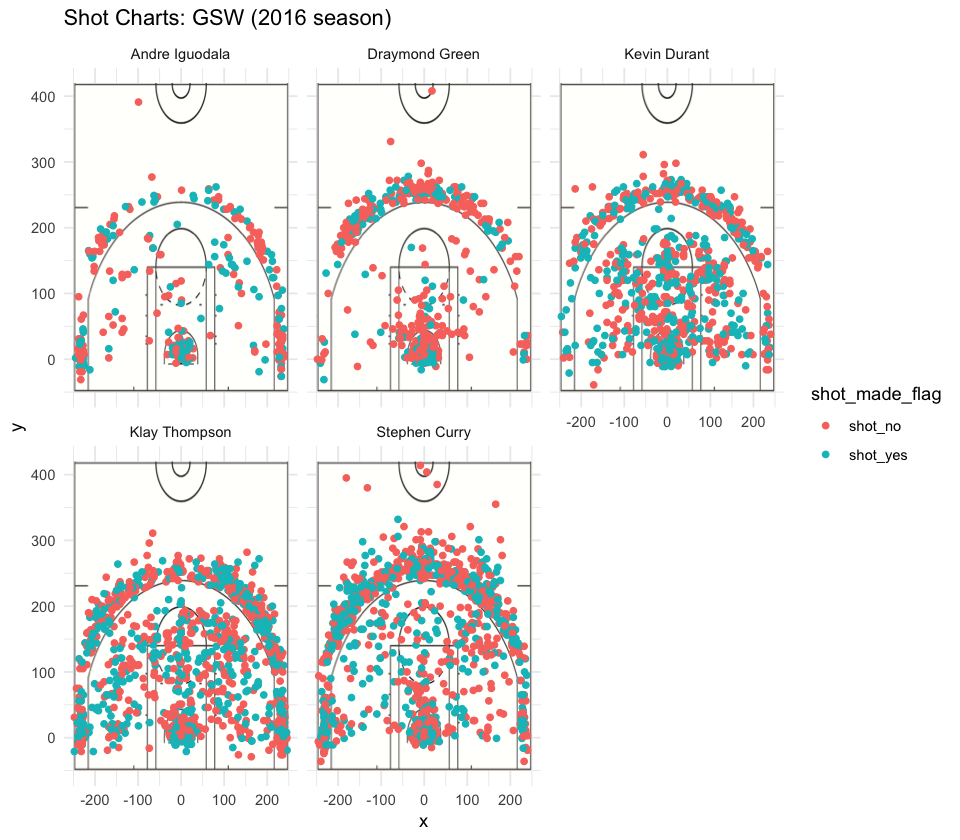

```{r, echo = FALSE, results = 'hide', message = FALSE}
library(dplyr)
```

```{r, echo = FALSE, results = 'hide'}
data_types = c("team_name"="character", "game_date"="character", "season" = "integer", "period"="integer",
               "minutes_remaining"="integer", "seconds_remaining"="integer", "shot_made_flag"="character",
               "action_type"="factor", "shot_type"="factor", "shot_distance"="integer", "opponent"="character",
               "x"="integer", "y"="integer")
combine <- read.csv("../data/shots-data.csv", stringsAsFactors = FALSE, colClasses = data_types)
```

###Introduction  
**Bzzzzzzz!** The buzzer rings and people cheer. The Golden State Warriors have won the game! Attending an NBA game can be really exciting and a fun experience. Underlying all the cheer and hype, however, there is so much information that we can analyze and explore. The purpose of this report is to tell a story of the Golden State Warriors and their amazing legacy in professional basketball, through shooting statistics of five specific players—Andre Iguodala, Draymond Green, Kevin Durant, Klay Thompson, and Stephen Curry.

```{r out.width = '80%', echo = FALSE, fig.align = 'center'}
knitr::include_graphics("../../gsw.svg")
```


###Background  
In order to analyze the data, first I downloaded them as raw csv files. I created a data dictionary explaining the variables. Then, I specified data types, read the csv files for each individual, and changed some variable values to make them more descriptive. Then I created summary text files of the five players and combined them into one file. To produce the data visualizations, I downloaded an image of an NBA court, and plotted the x and y coordinates of the location of the shots on the image. After doing so for each individual, I created a facetted chart of all five charts showing at once, giving me a comprehensive overview. 

###Motivation  
The purpose ties in to motivation for this article. I am working on this report to see summaries and visualizations of shooting data of five players in the Golden State Warriors team. By analyzing then visualizing the data, is it possible to support the claim that GSW is arguably one of the best teams in the NBA? And if so, can we see the reason for that? Can the numbers tell us a story?
As a sports (tennis) player myself, it is always fun to watch sports games and matches without thinking about the data that can be constructed from them. However, data can offer such a powerful insight into these sports, and sports analysts use data to provide facts that may not be obvious from shallow observations. This narrative supports a mini sports analytics report, taking a closer look at the effective shooting percentages of some of the Warriors. This can be interesting as well! 

###Data  
The data used are datasets on each of the individual players, including information about the date of the game played, what season the game was played, which period of the game the 2 or 3 pointer goal was attempted, how many minutes and seconds there were remaining in the game at the time the shot was shot, whether the goal was successful or not, what type of action move the player took, how far the shot was made from the goal, the opposing team, and the x and y coordinates of the location the shot was attempted on the court. 
I manipulated these datasets to combine them, see what percentage of shots each player makes successfully, and visualize the shots attempted on the court. 

###Analysis  
The effective shooting percentages for the five players are as follows: 
For two pointers:
```{r}
twopointers <- arrange(summarise(group_by(combine, name), total = sum(shot_type == "2PT Field Goal"), made = sum(shot_type =='2PT Field Goal' & shot_made_flag == 'shot_yes'), perc_made = made/total),desc(perc_made))
twopointers
```
For three pointers:
```{r}
threepointers <- arrange(summarise(group_by(combine, name), total = sum(shot_type == "3PT Field Goal"), made = sum(shot_type =='3PT Field Goal' & shot_made_flag == 'shot_yes'), perc_made = made/total),desc(perc_made))
threepointers
```
For all shots overall:
```{r}
allpoints <- arrange(summarise(group_by(combine, name), total = sum(shot_type == "2PT Field Goal" | shot_type == "3PT Field Goal"), made = sum(shot_made_flag == 'shot_yes'), perc_made = made/total), desc(perc_made))
allpoints
```
For NBA players, an effective shooting percentage over 45% is generally considered excellent. For the GSW, out of just the five players we analyzed, four of them had an overall shooting percentage higher than that. For 2 pointers, all of them shot with over 45% accuracy, with the average being 55.86%, and Iguodala leading with an impressive 63.81%. Thompson leads the 3 pointers effective shooting percentage, with 42.41%. Though the average and individual statistics for the 3 pointers are lower, the overall rates (for 2 and 3 pointers) are still very high, with an average of 48.42%. This average was calculated by using mean(allpoints$perc_made)
```{r}
mean(allpoints$perc_made)
```
This is a facetted shot chart, showing the location of the shots made for each individual. The colors indicate whether the shot was successful or not.
```{r out.width = '80%', echo = FALSE, fig.align = 'center'}

```

###Discussion  
These numbers, while surely impressive, are not surprising. The Warriors are known for shooting well. They’ve set records, and if they continue to keep playing at this rate, they are on track to set more. According to the NBA, they hold the record of the highest mark of 58.5% for effective field-goal percentage. Interestingly enough, these five players are the highest paid members in the Warriors. For the 2018-19 year, Curry was the highest-paid member, receiving approximately 37.5 million dollars, and he is the second-best paid player in the NBA overall. Other than the salary he receives from NBA, he also receives endorsements from well-known brands, such as Under Armour and Chase. The third-best paid player in the NBA is Kevin Durant, and he receives endorsements from Alaska Airlines, Google, and Nike. The least-compensated member among the five we analyzed was Iguodala, who made exactly 16 million dollars. The next-best paid member in the Warriors (so other than these five), was paid just over $8.3 million, which is about half of Iguodala’s pay. The salaries vary greatly, but seeing how well the five members shoot, it is not surprising that they are compensated so well. It is also not too surprising to see that two of these five players comprise the top three best paid players in the NBA. 

###Conclusion  
The Warriors are breaking records and gaining recognition more and more by each passing day, thanks to the players. The five that we analyzed—Iguodala, Green, Durant, Thompson, and Curry—are famous for being great players. It isn’t surprising that they are the best-paid members on the team. The data that we visualized do tell a story—especially the facetted shot charts. We can see in overview where each shot was made, which of the shots was successful, all at once. Data visualization is powerful as such. Seeing these shot charts, we can see that put together, the five players make up an integral part of the team that can outscore opponents without much difficulty.

###References  
NBA, Basketball Reference, CNBC

###Summary  
The Golden State Warriors are well-known for shooting well, and we are able to see that using the data of field goals made by just 5 players on the team. Using data analysis and visualization to see how the Warriors play is very interesting.